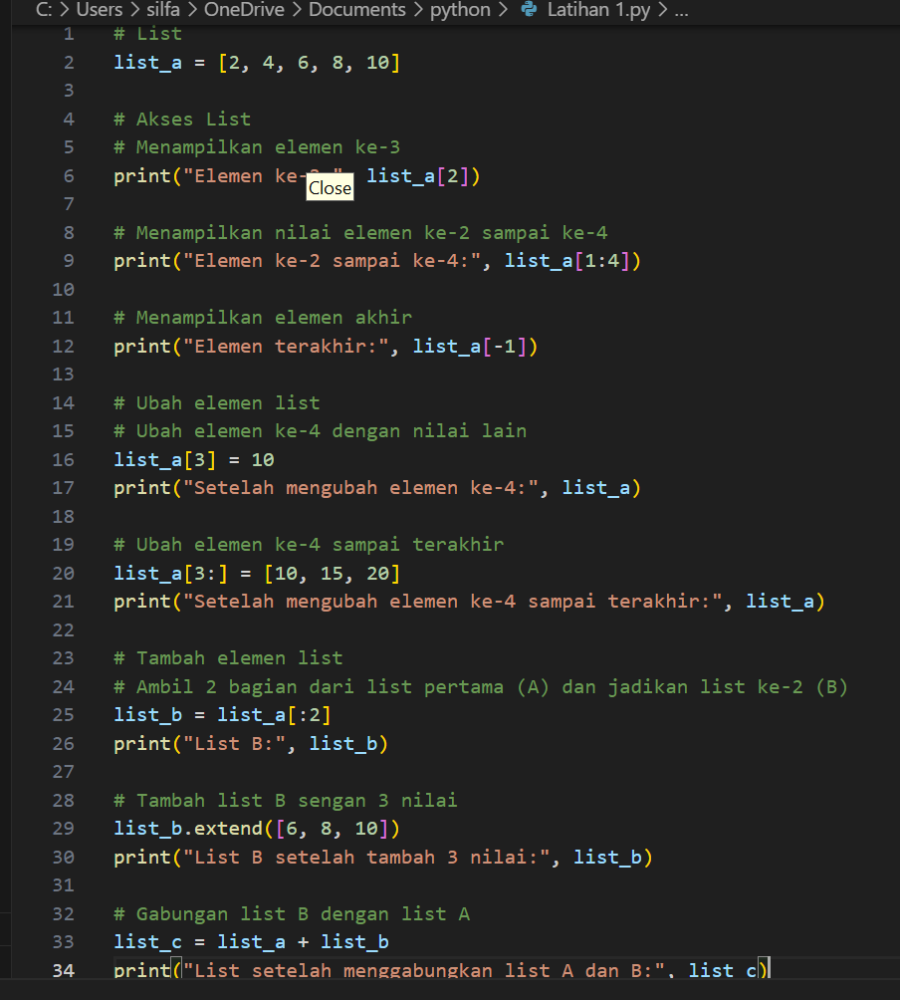
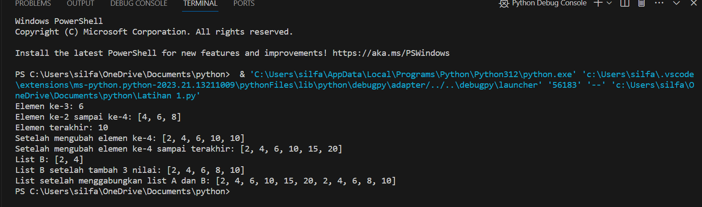
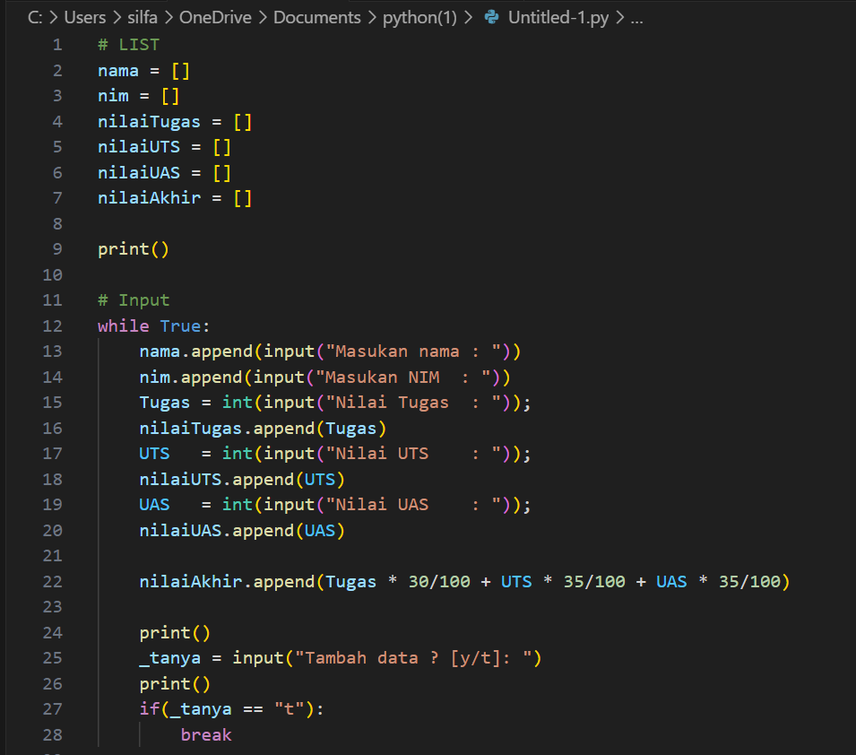
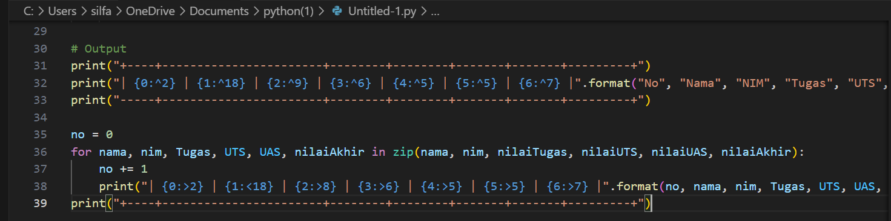
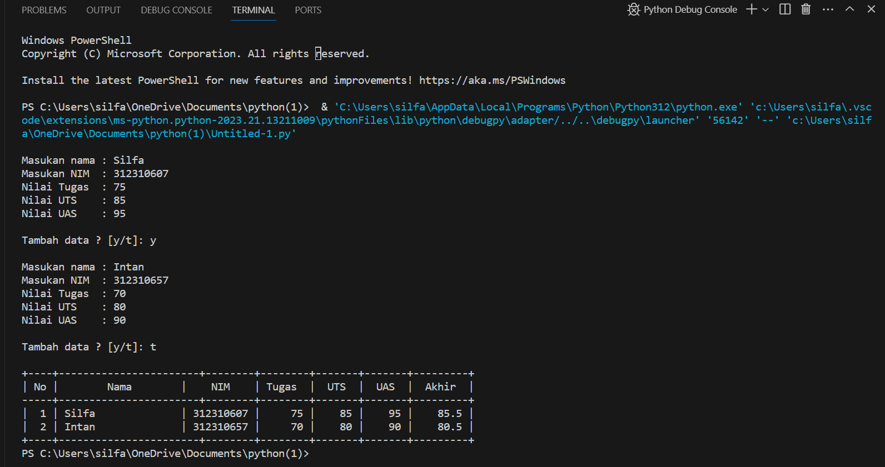
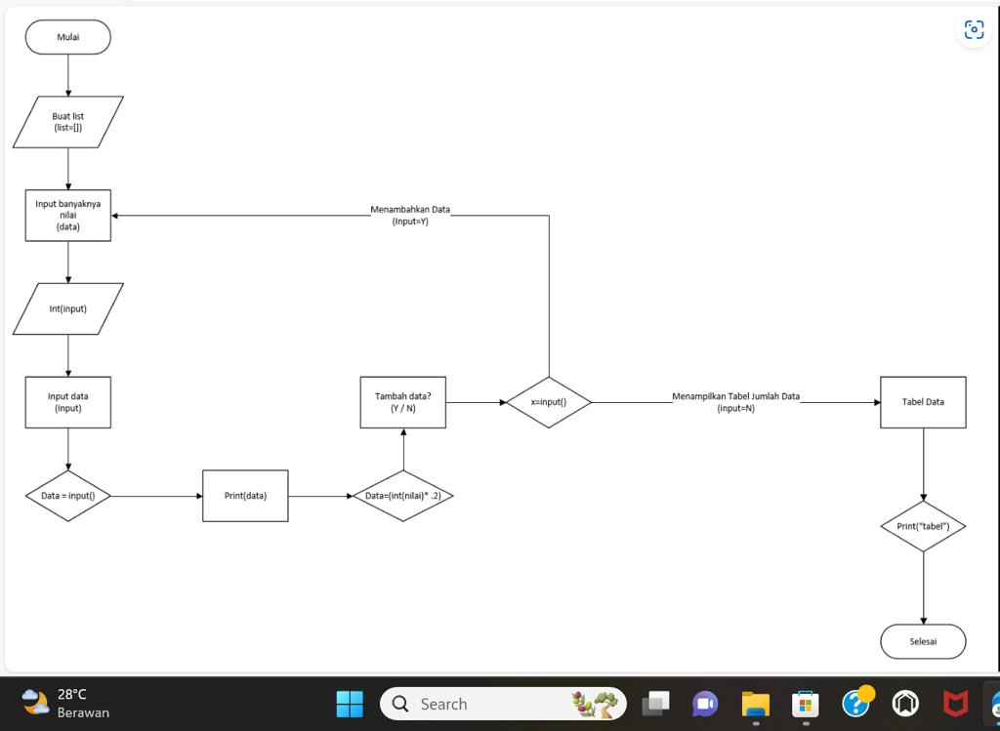

1. Membuat list yang diantaranya Nama,NIM, Nilai tugas,Nilai UTS, dan Nilai UAS
2. Setelah itu imput Nama, NIM, Nilsi tugas, Nilai UTS, dan Nilai UAS
3. Ketik 'ya' jika ingin menambahkan list data, dan ketik 'tidak' jika tidak ingin menambahkan data. Jawab input(("Tambah data y/t")).
4. Menggunakan perintah append pada Nama, NIM, Nilsi tugas, Nilai UTS, dan Nilai UAS untuk menambahkan 1 item ke elemen terakhir. lalu mencari nilai akhir de ngan menghitung nilai tugas 30%, UTS 35%, dan UAS 35%, dengan perintah float.
5. Setelah itu gunakan perulangan for, dengan print for i in range(len(Nama));, Fungsi 'len' untuk mengembalikan panjang (jumlah anggota) dari suatu objek.
6. Kemudian c etak dengan perintah print(i+1,Nama[i],NIM[i],TGS[i],UTS[i],UAS[i],Nilaiakhir[i])
7. selesai

# LATIHAN

# PRAKTIKUM

# FLOWCHART

